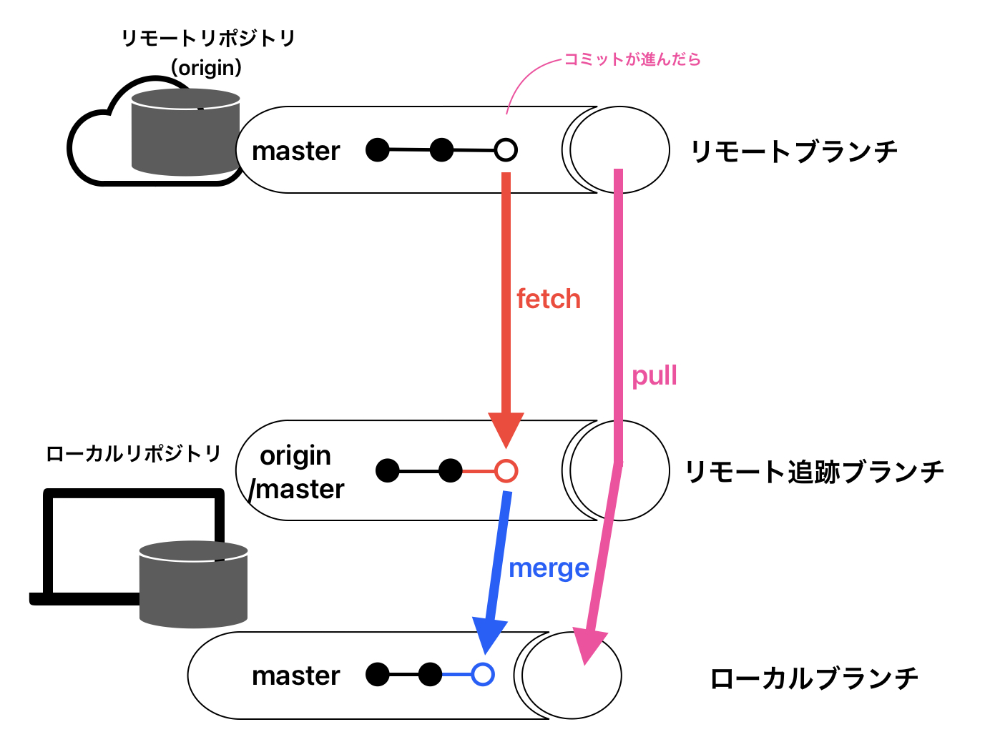

# ローカルとリモートリポジトリが異なる場合の対処法

##  ◽️ ① git pullについて
### git pull
主に、ローカルリポジトリが既に存在し、リモートリポジトリから変更を取得してローカルの作業を更新したい場合に使用

```rb
git pull [リポジトリ名] [ブランチ名]
```

git pull=fetch+merge

※ローカルの作業用ブランチまで一気通貫で最新の状態に更新したい場合はgit pullで問題ないが、コンフリクト（衝突）が発生する際など順を追って作業したい場合にはコマンドを分割して実行するのがよい


<br>

### fetch...リモート追跡ブランチ（origin/ナントカ）が更新されるだけ。この時点ではローカルブランチは更新されていない


```rb
git fetch
```
これでorgin/masterが最新になり

```rb
git merge origin/master
```
これでローカルのファイルが最新状態になる

### merge...mergeすることで、はじめてローカルブランチが更新される

```rb
git merge 取り込みたいブランチ
```

### ※fetchとmergeの違い
fetch はリモートから変更を取得し、merge は異なるブランチ間での変更を統合するために使用され、GitHub上でのコードの更新やコラボレーションを効果的に管理するのに役立つ

## ◽️ ②git cloneについて

### git clone
リモートリポジトリ全体をローカルマシンに複製するために使用<br>
主に、新しいプロジェクトを始めるときや、他の開発者が共有しているプロジェクトをローカルで開始する場合に使用<br>

👉git pull は既存のローカルリポジトリに変更を取り込むためのものであり、git clone は新しいリポジトリを作成してローカルに取得するためのもの
### ①リモートをローカルにクローンする

```rb
git clone (URL)
```
※クローンする際に使用するURLはGitHub上のリモートリポジトリ内にある緑の<>codeボタンをクリックするとURLがコピーできる


### ②クローンしたリポジトリを編集してプッシュする方法

1.ステータスを確認
```rb
git status
```
2.インデックスに追加
```rb
git add.
```

3.ステータスを確認
```rb
git status
```
4.コミットする
```rb
git commit -m"add files"
```

5.プッシュする
```rb
git push origin master
```
### 上記でエラーが出た際試すこと

① マージを行ってローカルとリモートの変更を統合する場合：

```rb
git pull origin main --allow-unrelated-histories
```
② マージではなく、リベースを使用してローカルの変更をリモートの変更に適用する場合：

```rb
git pull origin main --rebase
```

③ リモートの変更をローカルの変更に強制的にマージする場合：
```rb
git pull origin main --force
```
※リモートリポジトリから最新の変更を取得して、それをローカルのブランチにマージまたはリベースするためのコマンド

↓ 上記のどれかで成功したらプッシュし完了

```rb
git push origin main
```
